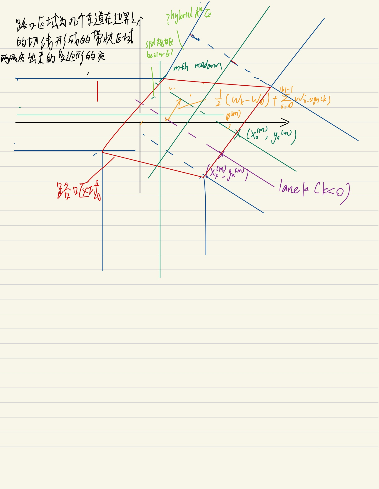

# 如何设置路口环境
## 1.路口参数化
### 1.1 地图设置
参考例程
[env](../路径规划例程/地图设置参考PathPlanning-master/PathPlanning-master/Search_based_Planning/Search_2D/env.py)

### 1.1.1 理论：非标准路口参数化
参考：Li N , Yao Y , Kolmanovsky I , et al. Game-Theoretic Modeling of Multi-Vehicle Interactions at Uncontrolled Intersections[J]. IEEE Transactions on Intelligent Transportation Systems, 2020, PP(99).

原来：假设路支汇聚于一点，路口宽度一致，路支为直线

本文扩展：路口不必汇聚于一点，路口宽度可以不一致，路支为曲线，考虑路口的静态障碍物(假设障碍物都是凸多边形)
$(N_{arm}, \{M_{f}^{(m)},\omega_{f}^{(m)}\}_{m=1}^{N}, \{M_{b}^{(m)},\omega_{b}^{(m)}\}_{m=1}^{N},\{\phi^{(m)}\}_{m=1}^{N},  \{x_{0}^{(m)}, y_{}^{(m)}\}_{m=1}^{N}, {O^{(n)}}_{n=1}^{N_{obs}})$

其中，$d^{(m)}$路口原点到第m条路支的距离。$(x_{0}^{(m)}, y_{0}^{(m)})$为第m条路支中心线和路口的交点。即路支中心线在以
原点为起点，$\phi^{(m)}$为向量方向，$d^{(m)}$为向量长度的法线上。或者说路支中心以$\phi$为斜率，过交界点。$O^{(n)}$为路口内第n个静态凸多边形障碍物的数据结构，存有该多边形的各个顶点坐标。

定义各个路支中心线函数，第m个路支的中心线函数为：$\sin \phi^{(m)}(x-x_{0}^{(m)}) - \cos \phi^{(m)}(y-y_{0}^{(m)}) = 0$(以$\phi$为斜率，过交界点)

可以用交界点$x^{(m)}, y^{(m)}$原点到直线的距离：$d^{(m)} = |-\sin \phi^{(m)}x_{0}^{(m)}+\cos \phi^{(m)}y_{0}^{(m)}|$.

对于车道号的定义：以x正方向为基准（若车道和x轴垂直则以y轴负方向为基准），路支左侧为正从1递增，右侧为负从-1递减，若中心线在某车道上，则该车道号码为0。

(0,0)到路支m中心线垂点的向量：$(x_{k,droop}^{(m)}, y_{k,droop}^{(m)}) = [d^{(m)}+\sum_{i=0}^{k}\omega^{(m)}_{i}-0.5(\omega^{(m)}_{k}+\omega^{(m)}_{0})](\cos \phi^{(m)}, \sin \phi^{(m)})$.注意，若第0条车道不存在，则$\omega^{(m)}_{0} = 0$.

定义各个车道中心线和路口交界点坐标，第m个路支的第k条车道的中心线和路口的交点：
$(x^{(m)}_{k}, y^{(m)}_{k})$和$(x_{0}^{(m)}, y_{0}^{(m)})$的距离$\Delta d = \sum_{i=0}^{k}\omega^{(m)}_{i}-0.5(\omega^{(m)}_{k}+\omega^{(m)}_{0})$

$(x^{(m)}_{k}, y^{(m)}_{k}) = (x_{0}^{(m)}, y_{0}^{(m)}) + sign(k)\Delta d(\cos \phi^{(m)},\sin \phi^{(m)})$。

定义各个车道中心线函数，第m个路支的第k条车道的中心线：$\sin \phi^{(m)}(x-x_{k}^{(m)}) - \cos \phi^{(m)}(y-y_{k}^{(m)}) = 0$(以$\phi$为斜率，过交界点)

广义路口区域：各个道路的并集，狭义路口区域：各个道路的交集

路口判断：几条道路的边界延长线围成的区域交集非空 问题：如何判断？

### 1.2 地图/寻路过程展示
参考例程
[plot](../路径规划例程/地图设置参考PathPlanning-master/PathPlanning-master/Search_based_Planning/Search_2D/plotting.py)

### 1.3 地图与路径规划算法的接口

## 2.路口入口出口设置

## 3.路口边界、内部障碍物设置

# 算法实现
## 1.避障贝塞尔

## 2. hybrid A*

## 3. 交界点/预瞄点选取

# 对照实验
## 1.性能指标选取
## 2.仿真环境选取
## 3.结果展示、分析